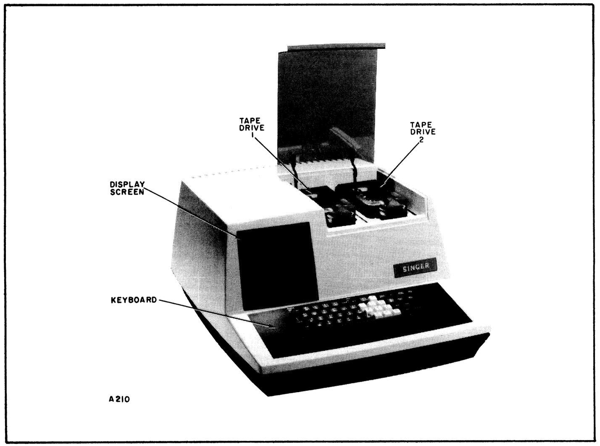
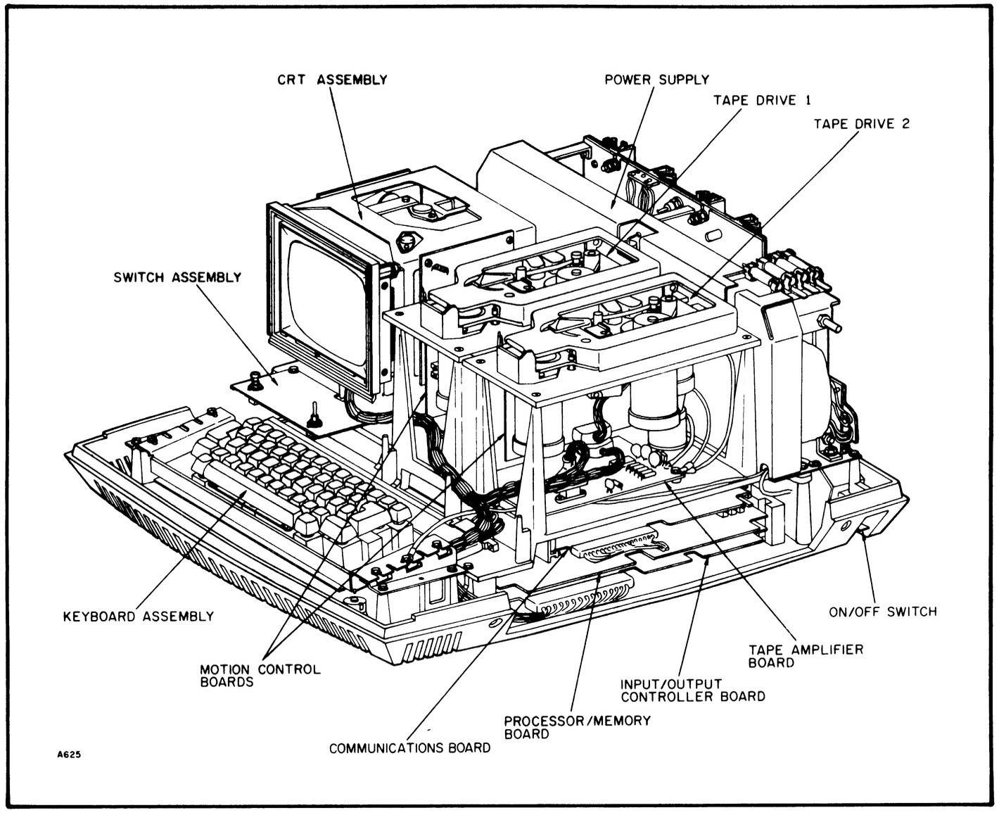
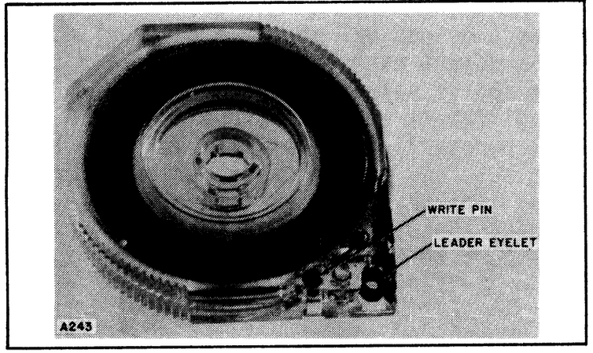
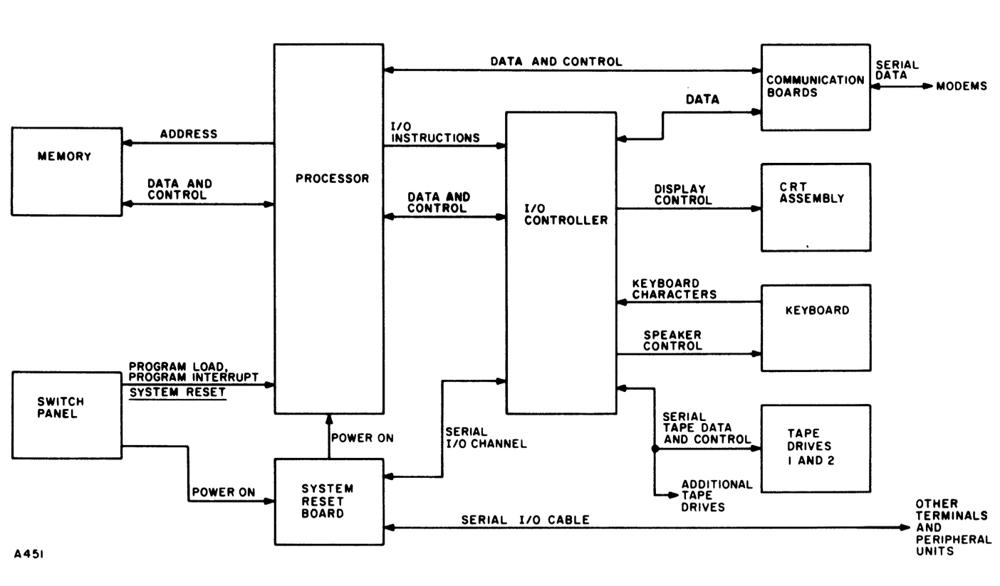
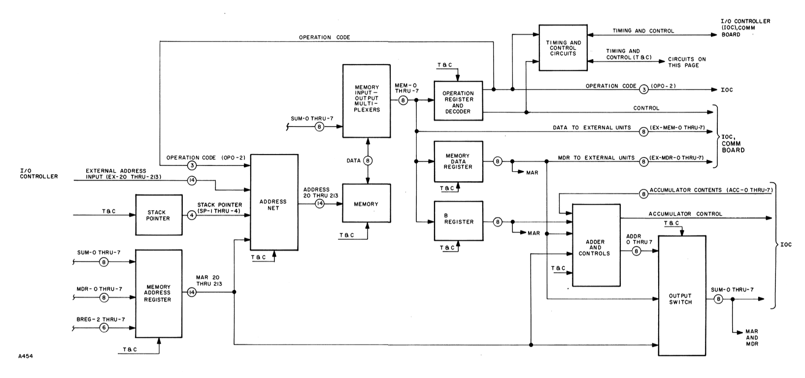
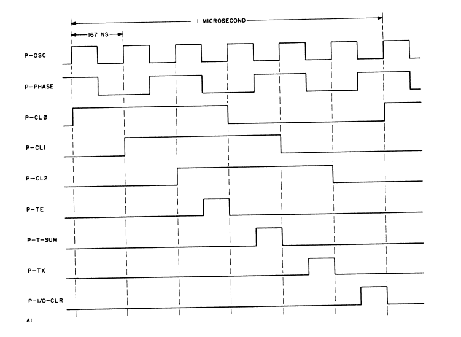

# SECTION 1
GENERAL DESCRIPTION  

## 1-1.  PURPOSE AND USE OF THE INTELLIGENT TERMINAL.

The Singer Model 1501 Intelligent Terminal is a desk-top unit that has a
wide range of data processing applications, such as inventory control,
payroll processing, sales analysis, and purchasing.  These various func-
tions can be accomplished by the use of different pre-recorded program
tapes.

The Model 1501, shown in figure 1-1, consists of a mini-computer, keyboard,
tape drives, and a display screen.  Within the unit are the processor,
memory, and input-output controller which comprise the computer.  These
components are printed circuit boards.  Two cartridge tape drives are
mounted on the upper right section of the unit.  Magnetic tape cartridges
loaded on these drives provide programs and store data for the computer.



*Figure 1-1. Model 1501 Intelligent Terminal*


A CRT and keyboard are housed in the terminal.  These components allow the
operator to perform the data processing for which the terminal is intended.
The keyboard allows the operator to enter data and control operation of the
computer, while the CRT displays data, questions, and instructions to
assist the operator.

The terminal can also communicate with other terminals and peripheral
equipment, such as tape units and printers, over a serial input-output
channel operated by the I/O controller.  With the addition of a communi-
cations adapter board to the main chassis and an external MODEM (modulator-
demodulator), the terminal also has the capability to transmit and receive
over telephone lines.

A well beneath the display screen houses the program load and system reset
switches.  After power is applied to the terminal, the first program is
loaded into the processor's memory from a tape drive cartridge.  This is
accomplished when the operator presses forward the program load switch.
This loads the program stored on tape into the processor memory.  From this
point on, the operation of the processor is under control of that program.

## 1-2.  MODELS AND OPTIONS AVAILABLE.

There are three basic models of the 1501.  They are: (1) the standard
1501; (2) the 1501-FF, which includes a transaction counter; and (3) the
1501-CL, which does not include tape drives and is intended to be operated
in the clustered mode with other terminals.  The suffix "CL" means
clustered.

There are several optional features that can be added to the terminal to
increase its capabilities.  These options and the basic Intelligent Terminal
part numbers are listed in table 1-1.  Where the suffix "XXX" appears in the
table, it indicates that the item is available in several different varia-
tions in which such things as power requirements, keyboard keytops, and
memory capacity differ.  Of course, other options may have been added or
part numbers changed since this manual was published so only the Illustrated
Parts Manual and the sales representative's catalog should be used for
selecting and ordering options.

Table 1-1.  Models and Options Available

| Model                                         | Part Number         |
|-----------------------------------------------|---------------------|
| 1501 Intelligent Terminal                     | 001-003200-XXX      |
| 1501-FF Intelligent Terminal                  | 001-002994-XXX      |
| 1501-CL Intelligent Terminal                  | 001-001000-XXX      |
| 1534A Asynchronous Communications Adapter     | 003-001907-XXX      |
| 1535A Binary Synchronous Communications Adapter| 003-001907-039      |
| 1530-1, 13-Key Numeric Pad                    | 003-003233-XXX      |
| Booster Transformer Option for 100 VAC Input  | 003-003350-006      |
| *Dual SIO Option*                             | 003-002830-008      |
| 1533 Dual Drive                              | 003-001574-XXX      |

*Must be included with 1501-CL


## 1-3. LOCATION OF MAJOR COMPONENTS.

The location of the tape drives, CRT, and keyboard assembly are shown in
figure 1-1.  However, most of the electronic components are mounted inside
the terminal, and the location of these components is shown in figure 1-2.

## 1-4. CONTROLS AND INDICATORS.

The Model 1501 Intelligent Terminal has relatively few operator controls
aside from the keyboard and pad.  All of these controls are described in
the Operator Instructions Manual; however, those of interest to the field
service engineer are summarized in the following paragraphs.




*Figure 1-2. Location of Major Components*


Following are the three controls used to apply power and start the terminal:

a. The POWER ON/OFF switch, located on the right rear bottom of the side
panel.

b. The PROGRAM LOAD switch, located in the well beneath the display
screen.  This switch, when pushed to the PROGRAM LOAD position, causes
the program to be loaded into the processor memory.  Except for the
1501-CL, the source of the program is the tape cartridge on tape drive
2.  In the 1501-CL, the program is available from another terminal
over the serial input-output channel.  This switch has three positions;
PROGRAM LOAD, off, and program interrupt.  The interrupt position,
which is not labeled, causes the processor program to jump to a
specific memory location (page 03, location 000) to perform an inter-
rupt servicing routine.

c. The SYSTEM RESET switch is located in the well beneath the display
screen.  This switch causes the processor program to jump to a
specific memory location (page 02, location 000) and start the program
located there.  The action the processor takes when the SYSTEM RESET
switch is used depends upon the program currently stored in the memory.

Both the normal operating programs and the diagnostic programs are stored
on tape cartridges.  Located on the outer case of the cartridge is a two-
position hole for the write pin.  If the write pin is inserted into the
position on top of the cartridge, the tape cannot be written on.  If the
write pin is inserted into the position on the bottom of the cartridge,
the tape may be written on; this is called the "write-enable" position.

Loading the cartridge is a simple procedure that is fully explained in the
Operator Instructions Manual.  Once the cartridge is placed in the loader,
the loader must be pushed down and the locking lever moved to the lock posi-
tion.  Of course, this procedure is reversed in order to unload a tape.

Normally, the processor rewinds the tape before instructions are given to
remove the cartridge.  If, however, the tape is to be removed before it
has been rewound by the processor, it is necessary to depress the red re-
wind pushbutton on the tape drive.  Once this button has been depressed,
the tape will be rewound and can be unloaded.

## 1-5. CAPABILITIES.

The capability of each terminal depends upon the options selected.  In the
following paragraphs, the capabilities of the standard components are de-
scribed first.  Following this description, the options available are
discussed.

### Display and Keyboard.

The terminal houses a 5-inch CRT on which a visual display is created.  Up
to 8 rows of 32 characters each can be shown.  Each character is formed on
a 5 x 7 dot matrix and is selected by the processor.  In the standard
character set, 64 different characters are available, including the alpha-
bet, numerals, and punctuation marks.  However, the keytops can be replaced
with any character set, and the processor program can create any character
set on the display.  The keyboard consists of a 52-key alphanumeric key-
board and an optional 13-key keypad.  A speaker is housed in the terminal
to provide audible cues to the operator.

### Processor.

Operation of the terminal is controlled by a computer housed within the
terminal.  This computer consists of a general-purpose processor, a memory,
and I/O controller.  The processor is a stored program, general-purpose
machine, with repertoire of 39 instructions.  The format of all instruc-
tions and data in the processor is organized into bytes (8 bits).  Instruc-
tion execution time ranges from three to six microseconds.

### Memory.

Memory capacity is a maximum of 16,384 bytes in 4096-byte increments.  The
memory is random access with read/write capability.

### I/O Controller.

An I/O controller is provided to handle data transfer between most I/O
devices and the processor.  This unit operates the cartridge tape drives,
the CRT and keyboard assembly, and a serial input-output channel.  This
channel can be cabled to as many as 64 terminals or peripheral equipment
units.  Cable length is a maximum of 1500 feet and cable impedance is
93 ohms.

### Cartridge Tape Units.

Except for the 1501-CL version, two cartridge tape units are standard in
the 1501.  Each holds one cartridge like that shown in figure 1-3.  The
data is recorded serially on a single channel tape at a density of 1600
bits per inch.  Capacity of each cartridge is 900 records of 143 bytes
each.  Reading and writing speed is 10 inches per second, and the tape is
driven at 40 inches per second during search and rewind operations.



*Figure 1-3. Tape Cartridge*

### Dual Serial Input-Output (SIO).

The standard terminal can communicate with other Series 1500 equipment
over one SIO channel.  The addition of a dual SIO board provides two SIO
channels.

### Communications Adapters.

The communications adapters are single boards that are added to the 1501
to allow the terminal to communicate with a MODEM and subsequently with
telephone lines.  Either the Model 1534 Asynchronous Communications Adapter
or the Model 1535 Binary Synchronous Communications Adapter can be used;
however, the terminal can accommodate only one such board.  This option is
either factory or field installable.

## 1-6. WEIGHT AND DIMENSIONS.

The Model 1501 Intelligent Terminal weighs approximately 64 pounds (29 kg).
Its dimensions are:

- Height - 10" (25 cm)  
- Width  - 18.5" (47 cm)  
- Depth  - 24" (60 cm)  

## 1-7. POWER REQUIREMENTS.

The Model 1501 Intelligent Terminal is available in versions that operate
on 100, 115, or 230-volt AC supplies.  However, the older models with the
Cogar power supply can operate only on 115 or 230-volt inputs.  These
models require the Booster Transformer Option if only a 100-volt input is
available.

- Voltage . . . . . . . . . . 100V RMS nominal, 50-60 Hz, Single Phase  
  Range . . . . . . . . . . .  90V - 110V RMS  

- Voltage . . . . . . . . . . 115V RMS nominal, 50-60 Hz, Single Phase  
  Range . . . . . . . . . . . 104V - 129V RMS  

- Voltage . . . . . . . . . . 230V RMS nominal, 50-60 Hz, Single Phase  
  Range . . . . . . . . . . . 208V - 258V RMS  

## 1-8. ENVIRONMENTAL REQUIREMENTS.

The Model 1501 Intelligent Terminal is designed to operate in a normal
office environment.  Listed below are the temperature and humidity limita-
tions for both normal operation and transportation and storage.

### Ambient Temperature

Operating:  +60°F to 90°F (15.6°C to 32°C)  
Storage:    -25°F to +135°F (-32°C to 57°C)  

### Relative Humidity

Operating:  20 to 80 percent  
Storage:    5 to 95 percent  


# SECTION 2  
FUNCTIONAL DESCRIPTION  

## 2-1. GENERAL.

The purpose and organization of the Model 1501 Intelligent Terminal were
briefly discussed in Section 1 of this manual.  This section begins with
a review of that material in order to introduce the detailed descriptions
that follow.

The Model 1501 is a small computer that includes a processor, a memory,
and an input-output controller.  These components are printed circuit
boards housed within the terminal.  Two tape drives, which are operated
by the computer, are mounted on the top right of the terminal.  Magnetic
tape cartridges loaded on these drives provide programs for the computer
and store data produced by the computer.

A CRT and keyboard, housed in the terminal, allow the operator to perform
the data processing for which the terminal is intended.  The keyboard
allows the operator to enter data and control operation of the computer,
while the CRT displays data, questions, and instructions to assist the
operator.

The terminal can also communicate with other terminals and peripheral
equipment, such as tape units and printers, over a serial input-output
channel operated by the I/O controller.  With the addition of a communi-
cations adapter board and an external MODEM (modulator-demodulator), the
terminal also has the capability to transmit and receive over telephone
lines.

The processor, memory, and I/O controller make up a small, stored-program,
general-purpose computer.  After power is applied to the terminal, the
first program is loaded into the processor's memory from the tape cartridge
on the second tape drive.  This is accomplished when the operator pushes
the PROGRAM LOAD switch, which causes the processor to perform a short
loading program stored in a read-only memory on the processor board.  This
program loads the program stored on the tape into the processor memory.
From this point on, the operation of the processor is under control of
that program.  The 1501-CL model does not have tape drives, however, and
it acquires programs over the serial input-output channel.

The processor has 41 different instructions in its instruction repertoire,
and there are many input-output instructions that are executed by the I/O
controller.  Since the data flow between units depends upon how the pro-
grammer uses these instructions, the following description discusses the
basic flow of data that can be accomplished rather than how data is pro-
cessed by any specific program.  Refer to the block diagram in figure 2-1
for the following discussion.



*Figure 2-1. Model 1501 Intelligent Terminal Block Diagram*


### Organization and Use of the Memory.

The memory in the 1501 Intelligent Terminal is expandable from a minimum of 4,096 bytes to 16,384 bytes in 4,096-byte increments. The memory is housed on the processor board.

The processor controls access to the memory through an address net and access control circuits. Either the processor or the I/O controller can supply an address to the address net; however, access to the memory is coordinated with the basic processor timing cycles, and the controller is allowed to gain access to memory only at specific points in the processor cycle.

Data to be stored in memory is routed to a memory input multiplexer, and is gated through the multiplexer under control of the processor. When data is read from memory, it is available through the memory output multiplexer. There, it is available to the processor and the I/O controller.

### Exchange of Data With the I/O Controller

The I/O controller is a printed circuit board mounted in the terminal. Its purpose is to control the keyboard, the CRT, the tape drives, and the serial I/O channel. It coordinates the exchange of data between these units and the memory.  

The processor initiates operation of the I/O controller when it decodes an instruction read from memory and finds it is an I/O instruction. (All I/O instructions have an operation code that begins with 17.) Sensing that the current instruction is an I/O instruction, the processor gates the instruction to the I/O controller for execution. There, it is decoded further to determine which device is selected and what action is required. From this point on, the I/O controller takes the action necessary to carry out the instruction independently of the processor except when data must be exchanged with the memory.  

Functions performed by the I/O controller are:  

a. Produce the CRT display.  
b. Control the keyboard and accept keyboard inputs.  
c. Control the tape drives, including reading and writing.  
d. Control the exchange of data through the communication adapters.  
e. Control operation of the serial I/O channel.  

---

### Display Generation

The standard display unit is a 5-inch CRT that is operated by circuits in the I/O controller. The display area on the CRT consists of 8 rows of 32 character positions. To initiate the display on a page of data, the processor sends an I/O instruction to the I/O controller. This instruction selects the CRT circuits and specifies the memory location of the data to be displayed. Since each page on the display consists of 256 characters, one "page" of memory, which consists of 256 bytes, is required to produce the display. Once the processor transfers the page number to the I/O controller, the controller requires no additional processor inputs to produce the display.  

The display is produced by a scanning process similar to that in a television receiver, except that the fast scan is vertical and the slow scan is horizontal. Each character is composed of columns of dots. As the scan approaches each character position, the controller gains access to the selected memory page and reads the code for the character to be displayed in that specific position. Based on that code, the controller again gains access to memory and this time reads the dot pattern required to construct the selected character. The dot pattern then causes the CRT beam to be unblanked at the appropriate position to produce dots that form the selected character. The only signals routed to the CRT assembly by the controller are the unblanking signals and the triggers required to begin and end the vertical and horizontal scans.

Once a page number has been selected for display, the I/O controller continues to read that page and produce the display. Of course, the processor can store new data in the selected page and this causes the display to change on the screen.

**Keyboard Inputs.**

Each time that the processor is ready to read the keyboard input, it branches to a program routine required to accept the keyboard input. It can either wait until the operator depresses a key or, if the keyboard input is not ready, it can proceed with the program and return later to read the keyboard.

An encoder built into the keyboard converts each key output into a 6-bit character code corresponding to the physical location of the key. Three control signals (alpha, numeric, and control) accompany the keycode. In the I/O controller, the control signals are converted to a 2-bit code to indicate whether the keyboard character is the control key and whether the keyboard is in the "lower case" or "upper case" mode. The 2-bit control code is then combined with the 6-bit character code to form a byte in the accumulator in the controller. At this point, the processor can examine and act upon the keyboard input.

**Operation of the Cartridge Tape Units.**

Except for the 1501-CL model, two cartridge tape drives are mounted on the top of the terminal. A cartridge holds 100 feet of narrow (0.15 inch wide) magnetic tape that records one channel of digital data in serial form. The processor controls these tape units by issuing I/O instructions to the I/O controller.

Circuits required to operate two tape drives are housed on the I/O controller board. Optional drives are available in a Model 1533 Dual Drive. A tape multiplex board in the Model 1533 contains circuits that are duplicates of some of the tape control circuits on the I/O controller board. Up to three Model 1533 Dual Drives can be used with each 1501.

Tape operation is initiated by I/O instructions sent from the processor to the I/O controller. These instructions first select the drive to be used, and then start the tape motion required. Read or write instructions then establish the mode.

When reading, serial data from the tape is moved into the I/O controller and converted to parallel form. The controller then notifies the processor when a byte is available, and the processor accepts the byte by issuing another I/O instruction. When writing, the processor transfers the byte to be recorded to the I/O controller. In turn, the controller converts the data to serial form, encodes it in the form required for recording, and shifts it serially to the tape unit.

**Operation of the Communications Adapters.**

Available for installation in the communication slot of the terminal are communication adapter boards that allow the terminal to communicate with other terminals or similar equipment over long distances via telephone or teletype lines. The circuits on these boards are basically serial-to-parallel and parallel-to-serial converters and timing synchronizers. Connected to each communications board is an external MODEM that transmits and receives over the long distance lines.

The processor initiates the communication by sending an I/O instruction to the I/O controller that selects the communication channel for operation. The I/O controller then activates the adapter board. To coordinate the operation, several timing and control signals are exchanged directly between the communication adapter and the processor; however, the actual data transfer takes place between the I/O controller and the adapter boards.

**Serial Input-Output Channel.**

All external peripheral equipment operates on the serial I/O channel. The channel is a single coaxial cable terminated at both ends. Up to 64 units can communicate with one another over this link, with the Intelligent Terminal acting as master and the peripheral units, such as printers and tape units, acting as slaves.

The processor initiates the operation by sending an I/O instruction to the I/O controller. In turn, the controller begins transmission on the line, addresses the selected unit (each unit has an address selection switch or plug), and sends commands as required to execute the instruction from the processor. The selected peripheral unit responds by returning its address, to verify that the link is established, and the control signals necessary to accomplish the exchange between it and the Intelligent Terminal.

It should be noted that all information sent over the serial I/O channel is in serial, phase-encoded form. The I/O controller accomplishes the synchronization required to establish the link. It also converts data from parallel to serial for transmission and serial to parallel for reception.


### 2-2. PROCESSOR.

The processor is a single board that is the second board from the bottom
of the chassis.  It is a small, stored program, general purpose computer
with a repertoire of 41 instructions.  This number does not include the
input-output instructions, which are executed by the I/O controller.

A block diagram of the processor is shown in figure 2-2.  Those familiar
with the organization of computers will recognize most of the basic ele-
ments, which are:

a. An operation register and decoder.  These circuits hold and decode  
   each instruction read from memory.

b. A memory data register, which holds data read from memory.

c. A B-register, which holds one of the operands involved in many of the  
   operations.

d. An adder, which performs the actual arithmetic or logical operation.

e. A memory address register, which holds the address of a memory loca-  
   tion to be used.

Other elements not shown on the block diagram but which normally are used
in general purpose computers are:

a. Index registers, which hold a value used to modify a memory address.  
   This processor has index registers but they are memory locations  
   rather than hardware registers.  Seven memory locations in each memory  
   section are reserved to be used as index registers.

b. An instruction address register, which holds the address of the memory  
   location in which the next instruction to be executed can be found.  
   Again, memory locations substitute for hardware registers.  Thirty-two  
   memory locations are reserved to hold instruction addresses.  A com-  
   plex scheme in which a counter, called the stack pointer, designates  
   the memory location to be read to acquire the address of the next in-  
   struction to be executed is used in this processor.  This scheme is  
   explained in detail later in this description.

c. An accumulator, which normally holds one of the operands involved in  
   an arithmetic operation and also holds the result when the operation  
   is completed.  This processor has an accumulator that performs the  
   aforementioned functions; however, it also serves as a primary input-  
   output register for the processor, and for this reason it is located  
   on the I/O controller board in order to simplify the I/O wiring.





#### Word Formats.

The processor is organized to handle both instructions and data in 8-bit
bytes. The bit positions in each byte are labeled 0 through 7, in order
by the power of two that the position represents.

A typical instruction format is shown in figure 2-3. Note that each in-
struction is made up of two parts: (1) the IWR, instruction word-right,
and (2) the IWL, instruction word-left. Memory addresses are also made
up of two bytes, left and right, while data is handled as a single byte.


```
                    IWL              IWR

             STORED AT EVEN    STORED AT ODD
              BYTE ADDRESS      BYTE ADDRESS
            ┌─┬─┬─┬─┬─┬─┬─┬─┐ ┌─┬─┬─┬─┬─┬─┬─┬─┐
            │1│0│0│0│0│0│0│0│ │1│0│0│0│1│0│0│0│
            └─┴─┴─┴─┴─┴─┴─┴─┘ └─┴─┴─┴─┴─┴─┴─┴─┘
             OPERATION CODE        ADDRESS
                   200               210
```

*Figure 2-3. Typical Instruction Format*

---

#### Memory Addresses.

Because the operation of the processor is very closely related to the
memory, a brief description of the memory addressing scheme is presented
here before operation of the processor circuits is discussed. The memory
in the Model 1501 is solid-state with a maximum capacity of 16,384 bytes,
and this memory is organized into groups of 256 bytes each; each group is
called a "page". Shown in figure 2-4 are the 77 (octal) pages that make
up a 16,384-byte memory.

An address of 14 bits is required to address a memory of 16,384 locations.
Since the processor is organized to handle 8-bit bytes, this requires two
bytes, as shown in figure 2-5. Note that the section bits and level bits
together are called the page number; they choose a 256-byte page. The
eight low-order bits are called "byte" number; they select one of the
256 bytes in the page. For example, the address format to select byte
320 (octal) of page 16 (called P16-320) would appear as shown in figure
2-6. This memory location can hold half of another memory address, half
of an instruction, or a data byte.


```
LEVEL 0   *P00*   *P10*   *P20*   *P30*    P40     P50     P60     P70
LEVEL 1   *P01*   *P11*   *P21*   *P31*    P41     P51     P61     P71
LEVEL 2   *P02*   *P12*   *P22*   *P32*    P42     P52     P62     P72
LEVEL 3   *P03*   *P13*   *P23*   *P33*    P43     P53     P63     P73
LEVEL 4    P04     P14     P24     P34     P44     P54     P64     P74
LEVEL 5    P05     P15     P25     P35     P45     P55     P65     P75
LEVEL 6    P06     P16     P26     P36     P46     P56     P66     P76
LEVEL 7    P07     P17     P27     P37     P47     P57     P67     P77

        SECTION SECTION SECTION SECTION SECTION SECTION SECTION SECTION
           0       1       2       3       4       5       6       7
        <----- 4K ----->
        <------------- 8K ------------->
        <---------------------------- 16K ---------------------------->
```

Figure 2-4. Organization of Memory


```
 ┌─────┬───────────┬─────┬───────────────────────┐
 │15 14│13 12 11 10│ 9  8│ 7  6  5  4  3  2  1  0│
 └─────┴───────────┴─────┴───────────────────────┘
   NOT    SECTION   LEVEL        BYTE
   USED└── PAGE NUMBER ──┘      NUMBER
```

Figure 2-5. Memory Address Format


```
 15 14 13 12 11 10  9  8  7  6  5  4  3  2  1  0
┌──┬──┬──┬──┬──┬──┬──┬──┬──┬──┬──┬──┬──┬──┬──┬──┐
│  │  │ 0│ 0│ 1│ 1│ 1│ 0│ 1│ 1│ 0│ 1│ 0│ 0│ 0│ 0│   P16-320
└──┴──┴──┴──┴──┴──┴──┴──┴──┴──┴──┴──┴──┴──┴──┴──┘
      │ SECTION│  LEVEL │         BYTE 
      |    1   │    6   │          320₈
      └──── PAGE 16 ────┘
```


*Figure 2-6. Sample Address*

---

### Instruction Addressing.

Operation of the processor is controlled by a program made up of instructions. This program is stored in memory, from which it is read and executed one instruction at a time. The address of the instruction currently being executed is held in two memory locations, called stack pointer addresses. There are 32 of these locations, which means that the addresses of 16 different instructions can be held in the "stack".

The contents of two stack pointer addresses are shown in figure 2-7. Note that the first location holds the byte number and that the second location holds the page number of the memory address in which an instruction is stored. In order to execute that instruction, the processor must read the contents of a pair of stack pointer addresses. (The setting of the stack pointer determines which pair of addresses is used.) Once the processor has read the instruction address from the memory location specified by the stack pointer, it then uses this address to read the instruction itself from memory.


```
    7  6  5  4  3  2  1  0        15 14 13 12 11 10  9  8
  ┌──┬──┬──┬──┬──┬──┬──┬──┐      ┌──┬──┬──┬──┬──┬──┬──┬──┐
  │  │  │  │  │  │  │  │  │      │ U│ V│  │  │  │  │  │  │
  └──┴──┴──┴──┴──┴──┴──┴──┘      └──┴──┴──┴──┴──┴──┴──┴──┘
           BYTE                       SECTION LEVEL
 FIRST STACK POINTER ADDRESS    SECOND STACK POINTER ADDRESS
```


*Figure 2-7. Contents of Stack Pointer Addresses*


Instructions and their corresponding addresses are written in the following format:

| Address of Instruction | Instruction |
|-------------------------|--------------|
| P03-100                 | 200-377      |
| P03-102                 | 260-001      |
| P03-104                 | 230-007      |

The first instruction above (200-377), load 377 into the accumulator, is located at octal location 100 of page 3. P03-100 is the address of the IWL, the 200 byte. The 377 byte (the IWR) is located at the address P03-101. These instructions would be stored in page 3 of memory as shown in figure 2-8.


```
        /     ├─────┼─────┼─────┼─────┼─────┼─────┼─────┼─────┤
        │ 070 │     │     │     │     │     │     │     │     │ 077
        │     ├─────┼─────┼─────┼─────┼─────┼─────┼─────┼─────┤
PORTION │ 100 │ 200 │ 377 │ 260 │ 001 │ 230 │ 007 │     │     │ 107
OF P03  │     ├─────┼─────┼─────┼─────┼─────┼─────┼─────┼─────┤
        │ 110 │     │     │     │     │     │     │     │     │ 117
        │     ├─────┼─────┼─────┼─────┼─────┼─────┼─────┼─────┤
        │     │     │     │     │     │     │     │     │     │
        \     ├─────┼─────┼─────┼─────┼─────┼─────┼─────┼─────┤
```

*Figure 2-8. Typical Location of Instructions in Memory*

---

### Use of the Stack Pointer.

As shown in the preceding discussion, the address of the current instruction consists of two bytes. It is called the instruction address word left and right (IAWL and IAWR). The IAW in an active program is held in two specific memory locations, initially P00-040 and P00-041. These two locations are the first two stack pointer addresses.


When instructions stored in sequential addresses are executed, the IAW is read from P00-040 and 041, incremented by two during execution of the instruction, and returned to P00-040 and 041. However, there are many cases in which an instruction transfers to a non-sequential memory location to acquire the next instruction. Non-sequential execution is encountered in programs that contain "Test" and "Branch" instructions. These instructions cause the program to jump to a non-sequential address if a certain condition is met.

Figure 2-9 illustrates the principles discussed above. Steps A and B illustrate the execution of instructions stored in sequential addresses. Step A is instruction 200-000 (Load Accumulator with 000), located at address P01-050. This instruction address is being held in the first stack pointer address P00-040 and P00-041. (The IAWR is in P00-040; the IAWL is in P00-041.)

While the Load Accumulator instruction is being executed, the IAWR (050) is incremented by two and inserted back into P00-040. Now the address of the current instruction is P01-052. This is shown in Step B.

The instruction stored in address P01-052 is a branch instruction. When branch instructions are executed, they put the new branch address into both stack pointer addresses (P00-40 and P00-41), as shown in Step C. Note that branch instruction 102-000 produces address P02-000 in the stack pointer address locations. This means that the instruction held in P02-000 is executed next.

Steps D and E again illustrate sequential instruction addressing; however step E is a stack-and-branch instruction. In addition to putting a new IAW into the stack pointer addresses, this instruction steps the stack pointer counter to cause the counter to "point" to the second pair of stack pointer addresses. This changes the location of the stack pointer addresses to P00-042 and 043. The old stack pointer addresses (SP0 in the figure) are not changed and they are left containing the address of the stack and branch instruction executed in step E. The purpose of storing the address of the instruction at which the branch took place is to allow the program to return to this point later. The new, and now the current, stack pointer addresses (SP1 in the figure) contain the new "branch to" address.

Steps F, G, and H illustrate sequential execution using the new stack pointer addresses (SP1) to hold the instruction address words. Step H is an exit instruction. This instruction does not contain any "branch to" address. It simply steps the stack pointer counter down one, returning to stack pointer addresses P00-040 and 041 to get instruction address words. The IAW retrieved is 004-002. This is incremented by two to obtain instruction address P02-006, in step I, and thus the program has


```
         CONTENTS OF        CONTENTS OF
         FIRST STACK        SECOND STACK
       POINTER ADDRESS     POINTER ADDRESS
     │P00-040│ │P00-041│ │P00-042│ │P00-043│
     └───────┘ └───────┘ └───────┘ └───────┘ 
             SP0                 SP1
     ┌─────────────────┐ ┌─────────────────┐      INSTRUCTION   INSTRUCTION
STEP    IAWL      IAWR      IAWL      IAWR         LOCATION 
     ┌────────┬────────┐ ┌────────┬────────┐       ┌───────┐     ┌───────┐
  A  │   050  │   001  │ │    ?   │    ?   │        P01-050       200-000
     └────────┴────────┘ └────────┴────────┘
     ┌────────┬────────┐ ┌────────┬────────┐
  B  │   050  │   001  │ │    ?   │    ?   │        P01-052       102-000
     └────────┴────────┘ └────────┴────────┘

     ┌────────┬────────┐ ┌────────┬────────┐
  C  │   000  │   002  │ │    ?   │    ?   │        P02-000       300-111
     └────────┴────────┘ └────────┴────────┘
     ┌────────┬────────┐ ┌────────┬────────┐
  D  │   002  │   002  │ │    ?   │    ?   │        P02-002       200-001
     └────────┴────────┘ └────────┴────────┘
     ┌────────┬────────┐ ┌────────┬────────┐
  E  │   004  │   002  │ │    ?   │    ?   │        P02-004       123-026
     └────────┴────────┘ └────────┴────────┘

     ┌────────┬────────┐ ┌────────┬────────┐
  F  │   004  │   002  │ │   026  │   003  │        P03-026       240-001
     └────────┴────────┘ └────────┴────────┘
     ┌────────┬────────┐ ┌────────┬────────┐
  G  │   004  │   002  │ │   030  │   003  │        P03-030       300-222
     └────────┴────────┘ └────────┴────────┘
     ┌────────┬────────┐ ┌────────┬────────┐
  H  │   004  │   002  │ │   032  │   003  │        P03-032       140-000
     └────────┴────────┘ └────────┴────────┘

     ┌────────┬────────┐ ┌────────┬────────┐
  I  │   006  │   002  │ │   032  │   003  │        P02-006       340-362
     └────────┴────────┘ └────────┴────────┘
     ┌────────┬────────┐ ┌────────┬────────┐
  J  │   010  │   002  │ │   032  │   003  │        P02-010       111-056
     └────────┴────────┘ └────────┴────────┘
```

*Figure 2-9. Use of the Stack Pointer*

Returned to the point at which the branch took place (the next instruction address after the instruction in step E). The stack pointer addresses continue to be P00-040 and 041 unless another stack-and-branch instruction is executed, and the contents of the SP1 locations do not change.

As previously mentioned, the purpose of the stack-and-branch, then exit, instructions is to preserve the "come from" address and allow the program to return to this address by executing the exit instruction. This allows the sharing of subroutines by different areas of the main program. A maximum of 16 consecutive stack and branch operations are possible before returning to the original starting point. The IAW's are stored in stack pointer addresses P00-040 through P00-077.


### Data Addressing.

Data bytes can be addressed by an instruction in any one of three different addressing modes: immediate, direct, or indexed. In the immediate addressing mode, the IWR is used as the data byte, and no further memory access is required by the current instruction. Immediate addressing provides a means of entering a constant into the accumulator by specifying the constant in the IWR of the instruction in which it is used. For example, instruction 200-311 causes an octal 311 to be loaded into the accumulator.

In the direct addressing mode, the IWR is used as the address of the data byte. Since only the eight bits of the IWR are available for an address, only 256 (377 octal) selections are possible. Essentially, a byte within a page can be selected in the direct addressing mode but the page itself cannot be chosen.

In this mode, the page number is established by two conditions. First, the section of memory (0 through 7, the most significant digit of the page number) can be selected by a Set Memory Section instruction previously executed. Second, the level of memory (0 through 7, the least significant digit of the page number) is not supplied. Therefore, it is effectively zero. Thus, instructions executed in the direct addressing mode can select addresses in pages 00, 10, 20, 30, 40, 50, 60, and 70, with the most significant digit of the page number having been previously established. For example, instruction 210-240 causes the contents of P00-240 to be loaded into the accumulator if memory section 0 is selected.

The indexed addressing mode provides a method of addressing data stored *anywhere* within memory. An indexed address is composed of a byte address contained in a specified index register in memory plus a page address contained in the IWR. The high-order six bits of the IWR (2-7) specify the page within memory and the index register specifies the location within that page. Bits 0-2 of the IWL select the index register to be used.

An example of an instruction executed in the indexed address mode is 213-050, the format of which is shown in figure 2-10. This instruction causes the contents of the location in P12 specified by the contents index register 3 to be loaded into the accumulator. If index register 3 contained 145 (octal), for example, the contents of P12-145 would be loaded into the accumulator. The two low-order bits of the IWR determine what changes the instruction makes in the contents of the selected index register, as follows:

- **00** - Leave unchanged  
- **10** - Increment by 1  
- **11** - Decrement by 1  


```
       IWL               IWR
┌─────────┬─────┐ ┌───────────┬───┐
│1 0│0 0 1│0 1 1│ │0 0 1 0 1 0│0 0│
└───┴─────┴─────┘ └───────────┴───┘
          \──┬──/ \─────┬─────/
             │          └──> SELECTS P12
             └─────────────> SELECTS I3
```


*Figure 2-10. Format of an Instruction Using the Indexed Address Mode*

**Processor Timing.**

The basic timing unit for the processor is the machine cycle, which is one microsecond long. Figure 2-11 is a timing diagram in which the signals generated during each machine cycle are shown. A 6 MHz oscillator is the source of the timing signals. A counter and count decoding gates then use the oscillator output to produce the rest of the timing signals shown in the figure.

**Instruction Cycles.**

The next timing division in the processor is the instruction cycle, which is the time required to acquire an instruction and execute it. Depending upon the type of instruction, an instruction cycle is made up of three to six machine cycles. Thus, an instruction may require between three and six microseconds.

As stated above, a maximum of six machine cycles are required to perform an instruction. These cycles are designated I (instruction) or E (execution) as follows: I1, I2, I3, I4, E2, and E3.

Instructions can be divided into four general classes:

Class 0, Jump Instructions

Class 1, Branch and I/O Instructions

Class 2, Transfer and Arithmetic Instructions

Class 3, Boolean and Compare Instructions




*Figure 2-11. Machine Cycle Timing Diagram*

The class to which an instruction belongs is indicated by the two most significant bits of the left byte of the instruction word, which are 0, 1, 2, or 3, corresponding to the class of instructions. Instruction cycles I1 through I4 are common to all instruction classes, while execution cycles E2 and E3 operate only during Class 2 and Class 3 instructions. Table 2-1 shows the cycles required for each class of instruction.

The number of machine cycles in an instruction depends upon the instruction and the conditions that exist when the instruction is executed. Since the IWL, which contains the operation code, is read during cycle I3, the following discussion defines the starting cycle as I3. Figure 2-12 shows the functions performed during each cycle.

At the beginning of cycle I3, the address of the instruction to be executed has been formed in the memory address register and is applied to the address net. The least significant position of the address net is controlled directly by the I3 and I4 signals. During I3, it is held at zero to read an even address and during I4 it is switched to a one to read the odd address.


*Table 2-1. Cycles Required by Each Instruction*

```
| IWL  | TYPE                  | REQUIRED CYCLES          |
|------|-----------------------|--------------------------|
| 0XX  | Neither               | I₁, I₂, I₃, I₄           |
| 10X  | Direct,               |                          |
| 11X  | Indexed,              |                          |
| 12X  | Nor                   |                          |
| 13X  | Immediate             |                          |
| 14X  | Address               |                          |
| 15X  |                       |                          |
| 16X  |                       |                          |
| 17X  |                       |                          |
|------|-----------------------|--------------------------|
| 20X  | Immediate             | I₁, I₂, I₃, I₄, E₃       |
| 22X  | Address               |                          |
| 24X  |                       |                          |
| 26X  |                       |                          |
| 30X  |                       |                          |
| 32X  |                       |                          |
| 34X  |                       |                          |
| 36X  |                       |                          |
|------|-----------------------|--------------------------|
| 21X  | Direct or             | I₁, I₂, I₃, I₄, E₂, E₃   |
| 23X  | Indexed Address       |                          |
| 25X  |                       |                          |
| 27X  |                       |                          |
| 31X  |                       |                          |
| 33X  |                       |                          |
| 35X  |                       |                          |
| 37X  |                       |                          |
|------|-----------------------|--------------------------|
```

During the first half of I3, the IWL is read. This byte is then loaded into the operation register, the B register, and the memory data register. At this point, the operation code is decoded and instruction execution can begin.

During the second half of I3 the I/O controller gains access to memory. The I/O controller reads either character codes or dot patterns for the CRT display.


[FReD PAGE 2-19]


### Tape Control Circuits.

Up to eight cartridge tape drives can be operated by the Model 1501 Intel-
ligent Terminal; two are standard and six are optional.  The optional
drives are added in pairs in the Model 1533 Dual Drive, which is a separate
unit.  The tape itself is very narrow (0.15 inches wide), and it records
only one channel of serial data.  A small cartridge holds 100 feet of this
tape.  The cartridge is installed in a simple tape drive.  A description
of the tape drive appears later in this section.

#### Recording Method

Before the tape control circuits can be discussed, the recording method
and format must be described.  The data is recorded in the Manchester
Code, which is also called phase encoding.  In this method, a signal
transition always occurs in the center of a bit period regardless of
whether the bit is a one or a zero.  The direction of the transition
indicates the bit value; a positive-going transition indicates a one
and a negative-going transition indicates a zero.  Since a signal tran-
sition always takes place in the center of a bit period, the timing
signals required to process the data when it is read can be developed

directly from the signal itself.  This allows considerable variation in
tape speed with no effect on the data.

#### Tape Format

Data recorded on the tape is organized into records, each record consisting
of 143 bytes, as follows:

a. A 3-byte preamble.  Two all-zero bytes followed by a byte with a one
   in **bit position 7** and zeros in positions 0-6.

b. An 8-byte header.

c. 128 data bytes.

d. A CRC (cyclic redundancy character) byte, which is calculated by the
   processor and is used for error checking.

e. A 3-byte postamble.  A byte with a one in **position 0** and zeros in
   positions 1-7, followed by two all zero bytes.

The format of each record is shown in figure 2-38.  Note that the tape can
be read in either direction.  When the tape is read forward, the preamble
produces 23 zeros followed by a one; when the tape is read backward, the
postamble produces 23 zeros followed by a one.  This is the synchronization
pattern required by the reading circuits in order to locate the beginning
of a record and start reading.

#### Tape Commands

Input-output instructions are sent from the processor to the I/O controller
to control the tape units.  In turn, the I/O controller decodes the in-
structions and sends commands to the tape motion control circuits to
manipulate the tape.  The input-output instructions related to tape oper-
ation and the action that each instruction produces is described in the
following paragraphs.

Figure 2-25 illustrates the I/O instructions.  Note that the two low-
order bits of the IWL select tape unit and that the IWR determines the
action to be taken.  Each instruction is described below; the number
given before the instruction title is the octal value of the IWR for that
instruction.

a. **000-Start Tape Forward at Normal Speed with Erase.**  
   This instruction
   is normally given at the beginning of a writing sequence.  It starts
   the tape moving forward at 10 inches per second and erases it until
   a write instruction is given.  Approximately 30 milliseconds are re-
   quired for the tape to reach a stable operating speed of 10 ips.


g. **007 or 207-Transfer Byte.**  
   This instruction controls the transfer of
   characters to and from the tape.  The transfer is controlled by a busy
   (not ready) condition within the tape control circuits, and the in-
   struction can be executed in two modes: (1) stall if busy (007), and
   (2) skip if busy (207).  In the stall-if-busy mode, the program stops
   at the transfer byte instruction until a tape sprocket signal is gen-
   erated, indicating that a byte has been written or read.  In the skip-
   if-busy mode, the program automatically skips the next instruction.

h. **010-Set Write Mode.**  
   This instruction starts the write operation and
   begins the timing sequence that controls the writing frequency, loads
   and shifts the tape buffer, and generates the sprocket signal.

i. **011-Set Read Mode.**  
   This instruction activates the tape read circuits.
   It is executed only once in a normal tape read sequence, and setting
   of the read condition resets the write condition.

j. **012-Rewind.**  
   This instruction sets a rewind flip-flop for the speci-
   fied tape.  This flip-flop is reset only by the clip-in signal, which
   indicates that the tape is fully rewound.  This permits each tape to
   rewind independently of operations going on in other tape units.

---

### Tape Unit Selection

The circuits that select the tape unit to be used are shown on sheet 2 of
the I/O controller logic diagram.  Their purpose is to choose one of four
possible pairs, and then select one of the two tapes in the pair.

A series of gates and three latches determine which pair of tape units is
selected.  When power is first applied or whenever the general clear sig-
nal is given, these latches are set so that pair 1, the pair of units that
is standard in the 1501, is selected.  This causes the PAIR-1 signal to be
distributed within the tape control circuits.

The pair selected can only be changed by a Read Status I/O instruction
that specifies a tape other than the current tape.  In this case, the
Read Status instruction causes the tape selection circuits to examine
positions 3-5 of the IWR (MDR 3-5) and reset the latches based upon the
tape pair selected by these bits.

A tape select flip-flop chooses the tape unit within a pair.  When the
PROGRAM LOAD switch is activated, this flip-flop is switched to the
second tape.  Thus, when the unit is started, the first program is loaded
from the second tape in pair 1.

The state of the tape select flip-flop is then controlled by bits OP0,
1, and 2 of the I/O instructions.  When both bits are 0, the flip-flop
is left unchanged; thus, the current tape remains selected.  A one in


bit 0 selects tape A (the first tape) and a one in bit 1 selects tape B
by switching the tape select flip-flop to the proper state.  Note that
a switch on the I/O controller board can reverse the normal selection.

### Tape Multiplex Circuits

Shown on sheet 10 of the I/O controller logic diagram is a group of cir-
cuits called the tape multiplex circuits.  The purpose of these circuits
is to control the exchange of data and motion control signals between the
I/O controller and the first pair of cartridge tape units.  The additional
tape units, which are housed in the Model 1533, include a tape multiplexer
board that performs the same general function as the tape multiplex cir-
cuits shown on sheet 10 do for the first pair.

The tape multiplex circuits are divided into three groups.  The top group
on the sheet gates data and control signals to the tape unit A; the
second group of circuits performs the same function for tape unit B.
Shown at the bottom of the sheet is the third group of circuits mentioned
above.  The purpose of this group is to gate signals from both tape units
onto one set of lines to be processed in the I/O controller.

The first group of circuits is enabled when pair 1 is selected and the
TAPE A signal is active; the second group is enabled by the combination
of the pair 1 signal and an inactive TAPE A signal, which indicates that
tape B has been chosen.  Since both groups of circuits are identical,
only the tape A circuits are discussed.

One of the two control flip-flops in these circuits is the ERASE-A-F/F.
When the start-tape-forward-at-normal-speed-with-erase instruction is
executed, the SET-ERASE signal is gated to set the erase flip-flop.  The
gating signal is produced by the fact that pair 1 and tape A have been
selected.  The erase flip-flop is cleared by the reverse signal or the
general clear signal.

The output of the erase flip-flop is combined in two NAND gate write
drivers (103 and 106) with the data to be written on the tape.  Since
there is no data to be written until the write flip-flop is set to gate
the data to these circuits, the output of the write drivers is held so
that they drive in one direction without change, effectively erasing the
tape.  When the data is available, it alternates the driver output as
described in the discussion of recording.  The erase flip-flop is cleared
by the general clear signal and any operation that runs the tape in re-
verse.

A transistor monitors the write line to the tape unit.  Whenever an erase
or a write operation is begun and the writing circuit is broken, this
transistor supplies a high to a 2-input gate and produces the set write
fault (SWF) signal.  This signal is gated by the write signal to clear
the RUN flip-flop and set the RUNAWAY flip-flop.


The next control flip-flop to be discussed is the rewind flip-flop.  This
flip-flop is set by the Rewind instruction when tape A of pair 1 is
selected.  It is cleared either by the general clear signal or the CLIP-
IN-A signal, which indicates that tape has fully rewound and the clip has
returned to the home position.

Whenever the rewind flip-flop is set, it produces three commands to tape
unit A.  They are: REV-A (reverse), THS-A (tape high speed), and RUN-A.
These commands can also be activated by signals from the control circuits
on sheet 2; however, the rewind flip-flop produces them directly.  This
allows the control circuits to send a rewind command for one tape unit
and permits that tape unit to accomplish the rewind operation while the
control circuits deal with another tape unit.

The three commands mentioned above (REV-A, THS-A, and RUN-A) and a fourth
command TCA (tape control A) can be produced by signals from the control
circuits, as follows:

a. REV-A is produced whenever the forward-reverse flip-flop is set to
   reverse and tape A and pair 1 are selected.

b. THS-A is produced directly from the high-speed flip-flop output.

c. RUN-A and TCA are produced when the RUN flip-flop is set and tape A
   of pair 1 is selected.

The circuits shown at the bottom of sheet 10 process the following signals:

a. CART-IN (cartridge in).  One of these signals, which indicates that
   the tape cartridge is in place, is available from each tape unit.
   The pair 1 selected and the tape A or B signal gates the CART-IN sig-
   nal from the active tape to the single CART-OUT line to the accumula-
   tor on sheet 1, where it becomes bit 4 of the status word.

b. CLIP-IN.  This signal is handled in the same way as the CART-IN signal
   mentioned above.  It indicates that the tape clip is in the home
   (fully rewound) position.  A CLIP-OUT signal is gated to the accumu-
   lator to become bit 5 of the status word and to the control circuits
   where it clears the RUN flip-flop if the tape is operating in reverse
   and the clip reaches the home position.

c. EOT (end of tape).  An end-of-tape marker is placed approximately 10
   inches from the end of the tape supply.  This signal is gated from
   the active tape to the accumulator where it becomes bit 6 of the
   status word.

d. DATA-Q and PULSED ENERGY.  These signals are the result of sensing
   data on the active tape, and they originate in the tape amplifier.
   Their use is discussed in the description of the read circuits.


in the tape multiplex circuit they are simply accepted and gated to
the read circuits whenever pair 1 is selected.

### Write Clock

Timing of the data written on the tape is developed by two interconnected
shift registers shown in the lower left corner of sheet 3 of the I/O con-
troller logic diagram.  The TX signal from the processor, which occurs
once every microsecond, clocks one of the registers.  This register is
connected so that the output of its most significant stage is an 8-micro-
second squarewave.  Thus, the first register devides by eight.  This is
used as the clock input to the second register, which is also connected
to divide by eight.  Thus, the output of the most significant stage of the
second register is a 64-microsecond squarewave.  Note that the write clock
runs continuously whether or not the output is used.

### Writing on the Tape

After the instruction to move the tape is given, a short delay is intro-
duced by the processor program to allow the tape to reach its operating
speed of 10 ips.  Then the Set Write instruction is executed; this sets
the write flip-flop (110/111).  The output of the write flip-flop gates
the output of the write clock to step the bit counter (141) and to shift
the tape data shift register shown on sheet 1.  This starts the byte held
in the shift register moving serially into the phase encoder shown in the
lower center of sheet 3.

The phase encoder is made up of a flip-flop (166) and two NAND gates
(164 and 165).  Applied to one input of each NAND gate is the write clock
signal.  Applied to the second inputs of these NAND gates is the data bit
(WR-DATA) to be encoded, positive (P-WR-DATA) at one NAND gate and in-
verted (N-WR-DATA) at the other.

Timing diagram 2-39 shows the write clock signal (D13-6), the P-T-SHIFT
signal (which shifts the data serially to the phase encoder), the bit
periods and their contents, and the WR-DATA signals that this bit con-
figuration produces.  When WR-DATA signals and the write clock are applied
to the two NAND gates in the phase encoder, they produce the outputs
shown in the timing diagram.  To encode a zero, NAND gate 164 supplies a
direct set signal to the phase encoder flip-flop 166; to encode a one,
NAND gate 165 supplies a direct reset signal to the phase encoder flip-
flop.  The effect of these signals on the phase encoder output (D10-9,
P-DATA-IN) is shown in figure 2-39.

Two other signals are applied to the phase encoder flip-flop:

a. The P-WR-DATA signal is applied to the D-input of the flip-flop.  As
   shown in the timing diagram, this signal is high when a one is being
   encoded and is low when a zero is being encoded.


b. The write clock signal from D14-11 is applied to the clock input of
   the phase encoder flip-flop.  On every positive going transition, this
   signal transfers the value of the P-WR-DATA signal to the phase en-
   coder flip-flop.

The effect of the clocked input on the phase encoder is shown in the
timing diagram.  Note that it produces the transition in the P-DATA-IN
signal when two bits of the same value (1 or 0) are transmitted in suc-
cession.  When the bit value changes from one bit period to the next, the
transition in the P-DATA-IN signal is caused by the direct set and reset
inputs.

The bit counter on sheet 3 counts the signals that shift the tape shift
register and, when eight bits have been counted, it generates the TP-SPR


(tape sprocket) signal.  This transfers the next byte to be written from
the accumulator to the tape shift register, and it in turn is shifted
through the phase encoder.

Writing continues as long as the write flip-flop remains set.  The WRITE-
F/F signal gates the write clock signal to step the bit counter and to
produce the shift pulses for the tape shift register.  It also gates the
data from the phase encoder to the tape.

The way in which writing is terminated depends upon the program.  However,
there are three ways in which the write flip-flop can be cleared: (1)
general clear (N-GEN-CLEAR), (2) read flip-flop is set, or (3) tape is
switched from forward to reverse.

### Reading from the Tape

A brief review of the recording technique and format is required before
the reading process is described.  As discussed earlier in this section,
data is recorded on the cartridge tapes in phase-encoded form, and in
order to distinguish between the significant and non-significant transi-
tions a start pattern is required to allow the reading circuits to estab-
lish synchronization with the data.  When the tape is read in the forward
direction, the start pattern is called the preamble.

The preamble, which consists of 23 zeros followed by a one, performs three
functions:

a. It allows the reading circuits to synchronize reading with the tape
   flux changes.

b. It allows the reading circuits to distinguish between a data record
   and tape noise.

c. It allows the reading circuits to locate the first bit of data on the
   tape.

If the tape is read while moving in reverse, the postamble appears in the
same form as the preamble, 23 zeros followed by a one.  However, the pri-
mary purpose of the postamble is to allow proper reading of the last bit
in the record when the tape is being read forward.  If the postamble were
not used, the last bit of the record would take on undesirable character-
istics due to the lack of flux changes following the last bit.  Essentially,
the postamble terminates the record so that the last bit of valid data can
be recovered properly.

In the tape amplifier, the data read from the tape is routed through two
separate paths.  The first path is the energy detector circuit, the pur-
pose of which is to determine the presence of a signal on the tape.  The
signal from this circuit is labeled PULSED-ENERGY.  The second path is a


data amplifier and its output is labeled DATA-Q.  The reason for routing
the signal read from tape through two circuit paths is discussed below.

In phase encoding, the information is carried by the transitions of the
waveform, rather than by the amplitude.  The signal read from the tape is
amplified and clipped and is therefore relatively immune to amplitude
variations.  At this high gain, the background noise in the absence of
tape signals is sufficient to make it difficult to determine when legiti-
mate data is present.  To solve this problem, a separate, limited-gain
path is provided after the second stage of an amplification.  This channel
feeds an energy detector which responds to signals of pre-determined
amplitude and duration:  greater than 30 percent of nominal signal ampli-
tude and repeating within 250 microseconds for at least 1 millisecond.
The circuits in the tape amplifier determine that the amplitude require-
ments are met, while the tape reading circuits in the I/O controller deter-
mine that the pulsed energy signal meets the timing requirements.  Only
when both the amplitude and timing requirements are met are the reading
circuits allowed to recognize the DATA-Q signal.

Reading is ordinarily done with the tape moving forward.  In this case,
the processor sends the Start-Forward-at-Normal-Speed-Without-Erase com-
mand to the I/O controller, and the motion control circuits start the tape
moving forward at 10 ips.  If the Start-Tape-Reverse-at-Normal-Speed com-
mand is given, the motion control circuits move the tape in reverse at
10 ips.  Erasing is automatically prevented when the tape is moving back-
ward.

After the tape reaches operating speed and the Start Read command is given
to set the read flip-flop, the next step is to synchronize the operation
of the reading circuits with the data on the tape.  This is accomplished
by the circuits on sheet 4 of the I/O controller logic diagram and is
shown in the timing diagram in figure 2-40.

The first circuit involved is the PULSED-ENERGY one-shot (101, F12-9).
This one-shot is initially cleared by the general clear signal, and it
remains cleared until the tape amplifier detects the presence of data on
the tape.  This is the beginning of a record to be read, and the pulsed
energy signal is shown on the first line of the timing diagram.

Each negative-going transition triggers the pulsed energy one-shot.  While
the first 23 zeros in the preamble are being read, this occurs every 64
microseconds (assuming that the tape speed is the nominal 10 ips).  Thus,
the output of the PULSED ENERGY one-shot switches and remains in the active
state as long as data is not interrupted.  This is shown on the third line
of the timing diagram.

The next one-shot is the ENERGY one-shot (102, F12-7).  Before data on the
tape is detected by the PULSED ENERGY one-shot, 102 is triggered every
microsecond by the TX signal.  This keeps the ENERGY one-shot on


continuously.  After the PULSED ENERGY one-shot detects the pulsed energy
signal, its output also triggers the ENERGY one-shot by applying a steady
low to the active low input.  This allows the delay to expire, and the
output at F12-7 makes the transition shown in figure 2-40.  This transi-
tion sets ENERGY flip-flop 105.

The data from the tape (DATA-Q) is routed through two gates to the transi-
tion detectors.  Both the P-TF (tape forward) and N-TF (tape reverse)
signals are used as gating signals, thus the tape data can reach the de-
tectors during either forward or reverse tape motion.

The transition detectors are one-shot multivibrators arranged so that a
positive-going transition triggers the ones detector and negative-going
transition triggers the zeros detector.  When the transition occurs, the
detector output switches.  The output of the transition detectors are ORed


in gate 121 so that either transition shifts the output of gate 121 from
a low to a high.

At this point, the effect of the ENERGY flip-flop 105 on the transition
detectors is discussed.  When the read flip-flop is not set, the READ-F/F
signal holds the ENERGY flip-flop 105 in the reset state.  This holds a
low on the reset input of the ones transition detector (122) and prevents
ones from triggering the one-shot.  When the read flip-flop is set, ENERGY
flip-flop 105 is no longer held off and it can be set when energy is de-
tected by one-shots 101 and 102 discussed earlier.

When the tape amplifier detects the beginning of a record, the pulsed
energy signal, shown in line 1 of the timing diagram, is present.  This
triggers the pulsed energy one-shot 101 and retriggers it regularly, thus
switching pin 9 to a low and keeping it there unless a gap is detected.

The signal at F12-9 is applied to pin 5 of ENERGY one-shot 102.  The
negative-going transition triggers this one-shot, but since there are no
more transitions, the delay expires and the output of 102 (F12-7) switches.
This is shown in line 4 of the timing diagram.  Thus, once the beginning
of a record has been detected, 102 is reset and remains reset.

When 102 is first reset, the positive-going transition provides the clock
pulse required to set ENERGY flip-flop 105.  The P-ENERGY F/F signal thus
goes high and removes the low that held the ones transition detector off.

Before energy was detected, F12-9 and F11-6 were high, producing a low
at F4-11 and a high at F3-10.  This gates the write clock through gate 113.
This signal passes through gate 114 and triggers the tracking window one-
shots 127 and 128, forming the tracking window in synchronism with the
signal (the write clock) that was used to write the tape.

When energy is detected, this path is blocked and the zero transitions are
allowed to trigger the tracking window one-shots until the energy flip-
flop is set.  Then, the path through gate 118 is blocked.

Gate 120 now becomes the path to trigger the tracking window one-shots.
If either a one or a zero transition occurs within the window, it re-
triggers the tracking window one-shots.  If no transition occurs within
the window, the phase error flip-flop (132) is set and the tape error
F/F signal is produced at gate 133A.

Each time the signal N-01 WINDOW signal is produced, it causes the P-T-
SHIFT signal to occur.  This shifts the incoming serial data through the
tape shift register.  A NAND gate monitors the high and low order bits of
the register.  When this gate senses the end of the third byte of the
preamble, it produces the SET-READ-GATE signal.  This sets the TAPE-READ-
GATE-F/F on sheet 4, which was cleared when the read operation began, and
produces the read gate signal.


When the read gate signal is active, it allows the N-01-WINDOW signal
that produces shift pulses to also step the bit counter.  Every 8 bits,
this counter produces a byte complete signal.  In turn, this signal trans-
fers the byte in the tape shift register to the tape data buffer and pro-
duces the TP-SPR (tape sprocket) signal to notify the processor that a
byte is available.

### Tape I/O Stall Circuits

The keyboard stall circuits were discussed earlier in this section, and
the tape I/O stall circuits operate in a similar manner.  The primary
difference is that the tape I/O stall circuits operate when the processor
is writing on the tape as well as reading from it.  Of course, the key-
board stall circuits operate only when the processor is reading the key-
board input.

Shown on sheet 5 of the I/O controller logic diagram are the circuits that
generate the I/O stall signal sent to the processor.  The action that the
processor takes on the stall signal depends upon whether the Transfer Byte
instruction is 007, Transfer Byte-Unconditional, or 207, Transfer Byte-
Skip on Busy.  In the former, the processor remains at the current instruc-
tion until the byte is transferred.  In the latter, the processor skips
one instruction and proceeds.  Another Transfer Byte instruction must then
be executed to transfer the byte.  The timing of when this instruction
occurs is determined by the program.

The circuits that generate the I/O stall signal for tape data transfer are
shown in the center of sheet 5, and the I/O stall flip-flop is shown at
the right.  Note that the I/O stall flip-flop can be set by any one of
three sources (keyboard, tape, or serial I/O channel).

The TX signal from the processor samples NAND gate 135.  If a Transfer
Byte instruction is being executed and a tape unit has been selected, the
condition of flip-flop 137 determines whether or not the I/O stall flip-
flop will be set.

The TP-SPR (tape sprocket) signal indicates that a tape byte has been
processed.  In a reading operation, this indicates that a byte is ready
for the processor; in the writing operation, it indicates that the tape
can accept the next byte from the processor.  Applied to the clock input
of flip-flop 123, the tape sprocket signal sets this flip-flop to record the
fact that a byte has been processed.

NAND gate 124, which monitors the state of flip-flop 123, is checked at
TE of cycle 13.  If flip-flop 123 was set, this NAND gate sets flip-flop
137.  Then, at TX time, the I/O stall flip-flop cannot be set.  If, how-
ever, the tape sprocket signal had not set flip-flop 123, flip-flop 137
is still cleared at TX time and the I/O stall flip-flop is set.


Assuming that flip-flop 137 was set, the I/O clear pulse, which follows
TX, enables NAND gate 136.  This clears both flip-flops, 123 and 137, re-
turning the two flip-flops to their original condition in preparation for
the next tape sprocket signal and Transfer Byte instruction.

Assume next that a tape sprocket signal had not set 123 and consequently
137 was also left in the cleared condition.  In this case, the I/O stall
flip-flop was set and the processor reacted as described earlier.  The
tape sprocket then arrives.  It sets 123, and then 137 is set.  Either the
current Transfer Byte instruction (if the processor stopped) or the next
Transfer Byte instruction (if the processor skipped) transfers the byte
and clears both flip-flops.  Note also that the P-W-OR-R (write or read)
signal clears both flip-flops when it goes low at the end of a write or
read operation.

The I/O stall flip-flop is cleared by the general clear signal and at the
beginning of every I3 cycle.  I3 is the cycle during which an instruction
is read from memory.  Clearing the stall flip-flop at the beginning of
this cycle has the effect of removing the conditions that were used in the
previous instruction.

### Serial I/O Channel Circuits.

Sheets 7, 8, and 9 of the I/O controller logic diagram make up the serial
I/O channel control circuits.  These circuits transfer data between the
Intelligent Terminal and any of the other devices attached to the SIO
coaxial cable.  Up to 64 units can be attached to the cable.

Information on the SIO line is in phase-encoded form, and the data is self-
synchronizing in that the receiver regenerates the timing signal from the
phase-encoded data.  During the phase-encoded communication, information
is transmitted as energy level changes (transitions) along the coaxial
cable.  Positive-going transitions signify one-bits; negative-going tran-
sitions signify zero-bits.  Obviously, intermediate transitions must take
place between successive bits.  The intermediate transitions are termed
"insignificant" transitions, whereas information-bearing transitions are
termed "significant" transitions.  Receiver circuits differentiate be-
tween the significant and insignificant transitions.  (Refer to figure
2-41 for a diagram showing a typical data transmission.)

The intelligent terminals connected to the I/O cable may be operated in
either of two modes, master or slave.  Only a unit operating in the master
mode can initiate transmission.  Selection of master or slave modes of
operation is a function of the processor program.
